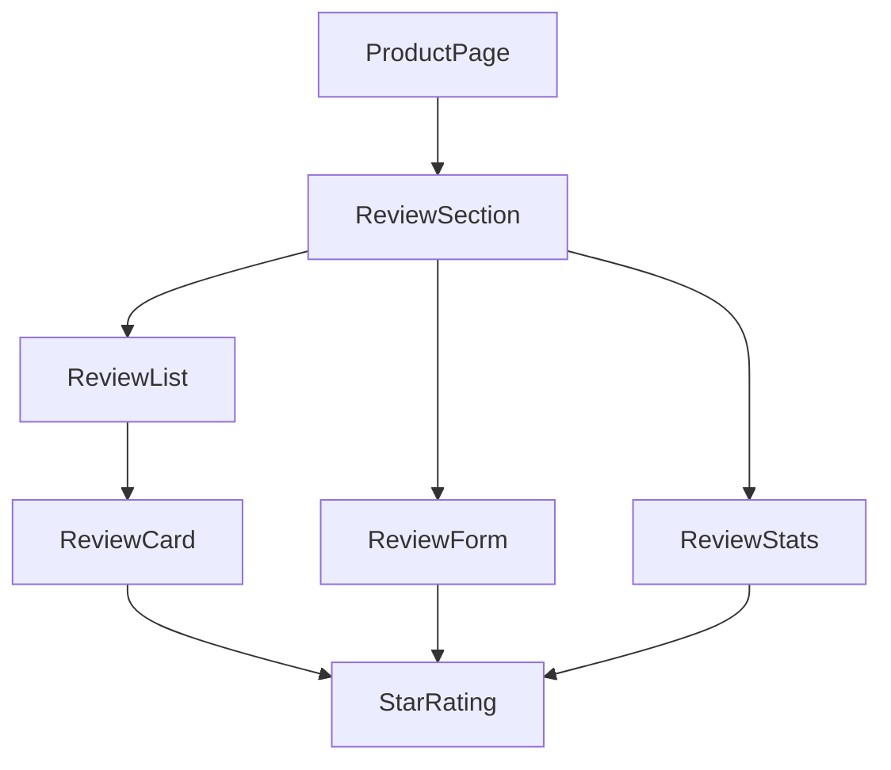
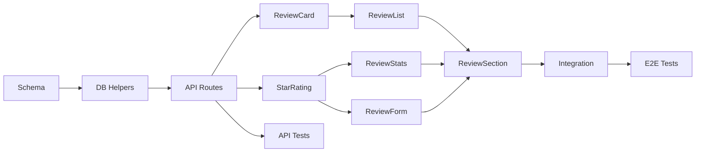

# Prompt-to-Plan Feature Specification

**Hero IDE - Spec-Driven Development System**

**Version:** 1.0  
**Author:** Manus AI  
**Date:** December 20, 2025

---

## Executive Summary

This specification defines the **Prompt-to-Plan** feature for Hero IDE, a system that transforms simple feature prompts into comprehensive, executable development plans. Drawing from research into leading AI planning tools including Traycer, Cursor Plan Mode, GitHub Spec Kit, and Amazon Kiro, this feature will enable Hero IDE to bridge the gap between "vibe coding" prototypes and production-ready software through structured, spec-driven development.

The core innovation is treating specifications as **living, executable artifacts** rather than static documentation. When a user describes a feature in natural language, the system generates detailed requirements, technical designs, and actionable tasks that AI agents can reliably execute while maintaining full traceability back to the original intent.

---

## Problem Statement

Modern AI coding assistants excel at pattern completion but struggle with complex, multi-file features that require understanding existing codebase context. The fundamental challenges include:

| Challenge | Impact | Current State in Hero IDE |
|-----------|--------|---------------------------|
| **Intent Drift** | AI makes reasonable but incorrect assumptions | PM Agent asks questions but lacks structured workflow |
| **Context Loss** | Decisions made early are forgotten later | No persistent spec artifacts |
| **Scope Creep** | Features expand without clear boundaries | Sprint Orchestrator exists but lacks spec integration |
| **Verification Gap** | No systematic way to check if implementation matches intent | Safety checker exists but not tied to specs |
| **Documentation Lag** | Code and docs diverge over time | No living documentation system |

Hero IDE already has foundational components—the PM Agent, Sprint Orchestrator, Kanban board, and execution engine—but lacks the structured workflow that connects user intent to verified implementation.

---

## Solution Architecture

### High-Level Flow

The Prompt-to-Plan system operates through four distinct phases, each producing artifacts that drive the next phase:

```
┌─────────────────────────────────────────────────────────────────────────┐
│                         USER INPUT                                       │
│  "Add a review system for products with star ratings and comments"      │
└─────────────────────────────────────────────────────────────────────────┘
                                    │
                                    ▼
┌─────────────────────────────────────────────────────────────────────────┐
│  PHASE 1: SPECIFY                                                        │
│  ┌─────────────────────────────────────────────────────────────────┐    │
│  │ • Intent Clarification (if needed)                               │    │
│  │ • User Story Generation with EARS acceptance criteria            │    │
│  │ • Edge Case Identification                                       │    │
│  │ • Success Metrics Definition                                     │    │
│  └─────────────────────────────────────────────────────────────────┘    │
│  OUTPUT: requirements.md                                                 │
└─────────────────────────────────────────────────────────────────────────┘
                                    │
                                    ▼
┌─────────────────────────────────────────────────────────────────────────┐
│  PHASE 2: DESIGN                                                         │
│  ┌─────────────────────────────────────────────────────────────────┐    │
│  │ • Codebase Analysis (existing patterns, dependencies)            │    │
│  │ • Data Model Design (schemas, interfaces)                        │    │
│  │ • API Contract Definition                                        │    │
│  │ • Component Architecture (Mermaid diagrams)                      │    │
│  │ • File Change Manifest                                           │    │
│  └─────────────────────────────────────────────────────────────────┘    │
│  OUTPUT: design.md                                                       │
└─────────────────────────────────────────────────────────────────────────┘
                                    │
                                    ▼
┌─────────────────────────────────────────────────────────────────────────┐
│  PHASE 3: TASKS                                                          │
│  ┌─────────────────────────────────────────────────────────────────┐    │
│  │ • Task Breakdown with Dependencies                               │    │
│  │ • Agent Assignment (PM, Dev, QA, DevOps, Research)               │    │
│  │ • Effort Estimation                                              │    │
│  │ • Test Requirements per Task                                     │    │
│  │ • Kanban Card Generation                                         │    │
│  └─────────────────────────────────────────────────────────────────┘    │
│  OUTPUT: tasks.md + Kanban cards                                         │
└─────────────────────────────────────────────────────────────────────────┘
                                    │
                                    ▼
┌─────────────────────────────────────────────────────────────────────────┐
│  PHASE 4: IMPLEMENT                                                      │
│  ┌─────────────────────────────────────────────────────────────────┐    │
│  │ • Agent Execution (one task at a time)                           │    │
│  │ • Verification Against Spec                                      │    │
│  │ • Progress Tracking                                              │    │
│  │ • Spec Sync (update docs if implementation reveals gaps)         │    │
│  └─────────────────────────────────────────────────────────────────┘    │
│  OUTPUT: Working code + updated specs                                    │
└─────────────────────────────────────────────────────────────────────────┘
```

### Integration with Existing Hero IDE Components

The Prompt-to-Plan system leverages and extends existing Hero IDE infrastructure:

| Existing Component | Current Role | Enhanced Role in Prompt-to-Plan |
|-------------------|--------------|--------------------------------|
| **PM Agent** | Chat-based planning assistance | Orchestrates entire spec workflow, generates artifacts |
| **Sprint Orchestrator** | Analyzes tasks, detects conflicts | Consumes spec artifacts, validates task dependencies |
| **Kanban Board** | Visual task management | Displays spec-linked cards with traceability |
| **Execution Engine** | Runs agent actions | Executes tasks with spec context injection |
| **Safety Checker** | Validates agent actions | Verifies implementation matches spec requirements |
| **Requirements Table** | Stores requirements (unused) | Persists spec artifacts with versioning |
| **Technical Designs Table** | Stores designs (unused) | Persists design artifacts with versioning |

---

## Detailed Phase Specifications

### Phase 1: Specify

The Specify phase transforms a natural language prompt into structured requirements that capture user intent unambiguously.

#### Input
- **Feature Prompt**: Natural language description (e.g., "Add a review system for products")
- **Context Files** (optional): Existing specs, mockups, or documentation
- **Constraints** (optional): Technology restrictions, compliance requirements

#### Process

1. **Intent Analysis**: The PM Agent analyzes the prompt to identify:
   - Primary user goal
   - Implied sub-features
   - Unstated assumptions

2. **Clarification Loop**: If ambiguity is detected, the system asks targeted questions:
   - "Should reviews be visible to all users or only verified purchasers?"
   - "Do you need moderation capabilities for inappropriate content?"
   - "Should ratings aggregate into a product score?"

3. **User Story Generation**: For each identified feature, generate user stories using the EARS (Easy Approach to Requirements Syntax) notation:

   ```
   WHEN [trigger condition]
   THE [system component]
   SHALL [expected behavior]
   SO THAT [user benefit]
   ```

4. **Acceptance Criteria**: Each user story includes testable acceptance criteria:
   - Happy path scenarios
   - Edge cases (empty states, error conditions)
   - Performance expectations
   - Accessibility requirements

#### Output: requirements.md

```markdown
# Feature: Product Review System

## Overview
Enable customers to leave star ratings and text reviews on products they have purchased.

## User Stories

### US-001: View Product Reviews
**WHEN** a customer views a product page  
**THE** review system  
**SHALL** display all approved reviews sorted by most recent  
**SO THAT** customers can make informed purchase decisions

**Acceptance Criteria:**
- [ ] Reviews display star rating (1-5), author name, date, and comment text
- [ ] Reviews are paginated (10 per page)
- [ ] Average rating displays at top with total review count
- [ ] Empty state shows "No reviews yet. Be the first to review!"

### US-002: Submit a Review
**WHEN** a verified purchaser clicks "Write a Review"  
**THE** review system  
**SHALL** present a form to submit rating and optional comment  
**SO THAT** customers can share their experience

**Acceptance Criteria:**
- [ ] Star rating is required (1-5 stars)
- [ ] Comment text is optional, max 2000 characters
- [ ] User can only review products they have purchased
- [ ] User can only submit one review per product
- [ ] Submission shows confirmation message

## Edge Cases
- User attempts to review without purchase → Show "Purchase required" message
- User attempts duplicate review → Show "You've already reviewed this product"
- Review contains prohibited content → Queue for moderation

## Success Metrics
- Review submission rate: >5% of purchasers
- Average review length: >50 characters
- Page load time with reviews: <2 seconds
```

---

### Phase 2: Design

The Design phase analyzes the existing codebase and generates a technical implementation plan that respects existing patterns and architecture.

#### Input
- **requirements.md** from Phase 1
- **Codebase Context**: Automatically gathered via codebase indexing
- **Architecture Constraints**: From project configuration or user input

#### Process

1. **Codebase Analysis**: The system scans the repository to understand:
   - Existing data models and schemas
   - API patterns and conventions
   - Component structure and styling approach
   - Test patterns and coverage requirements

2. **Data Model Design**: Generate TypeScript interfaces and database schemas:
   - Identify new tables/collections needed
   - Define relationships to existing entities
   - Specify indexes for query performance

3. **API Contract Definition**: Design the API surface:
   - tRPC procedures or REST endpoints
   - Input validation schemas (Zod)
   - Response types
   - Error handling patterns

4. **Component Architecture**: Create visual diagrams:
   - Component hierarchy (Mermaid)
   - Data flow diagrams
   - State management approach

5. **File Change Manifest**: List every file that will be created or modified:
   - New files with purpose description
   - Modified files with change summary
   - Deleted files (if any)

#### Output: design.md

```markdown
# Technical Design: Product Review System

## Data Model

### New Table: reviews
```typescript
export const reviews = sqliteTable('reviews', {
  id: integer('id').primaryKey({ autoIncrement: true }),
  productId: integer('product_id').notNull().references(() => products.id),
  userId: text('user_id').notNull().references(() => users.openId),
  rating: integer('rating').notNull(), // 1-5
  comment: text('comment'),
  status: text('status', { enum: ['pending', 'approved', 'rejected'] }).default('approved'),
  createdAt: integer('created_at', { mode: 'timestamp' }).notNull().default(sql`(unixepoch())`),
  updatedAt: integer('updated_at', { mode: 'timestamp' }).notNull().default(sql`(unixepoch())`)
});
```

### Indexes
- `idx_reviews_product`: (productId, status, createdAt DESC) - for listing reviews
- `idx_reviews_user_product`: (userId, productId) - for duplicate check

## API Design

### tRPC Procedures

| Procedure | Type | Auth | Description |
|-----------|------|------|-------------|
| `reviews.list` | Query | Public | Get paginated reviews for a product |
| `reviews.create` | Mutation | Protected | Submit a new review |
| `reviews.update` | Mutation | Protected | Edit own review |
| `reviews.delete` | Mutation | Protected | Delete own review |
| `reviews.getStats` | Query | Public | Get average rating and count |

### Input Schemas
```typescript
const createReviewInput = z.object({
  productId: z.number().int().positive(),
  rating: z.number().int().min(1).max(5),
  comment: z.string().max(2000).optional()
});
```

## Component Architecture



## File Change Manifest

### New Files
| File | Purpose |
|------|---------|
| `drizzle/schema/reviews.ts` | Review table schema |
| `server/reviews/db.ts` | Database query helpers |
| `server/reviews/router.ts` | tRPC procedures |
| `client/src/components/reviews/ReviewSection.tsx` | Main review container |
| `client/src/components/reviews/ReviewCard.tsx` | Individual review display |
| `client/src/components/reviews/ReviewForm.tsx` | Review submission form |
| `client/src/components/reviews/ReviewStats.tsx` | Rating summary |
| `client/src/components/reviews/StarRating.tsx` | Reusable star component |
| `server/reviews/router.test.ts` | API tests |

### Modified Files
| File | Changes |
|------|---------|
| `drizzle/schema.ts` | Export reviews table |
| `server/routers.ts` | Add reviews router |
| `client/src/pages/ProductPage.tsx` | Integrate ReviewSection |
```

---

### Phase 3: Tasks

The Tasks phase breaks the design into atomic, executable work items that can be assigned to AI agents and tracked on the Kanban board.

#### Input
- **requirements.md** from Phase 1
- **design.md** from Phase 2

#### Process

1. **Task Decomposition**: Break design into smallest implementable units:
   - Each task should be completable in <2 hours
   - Each task should be independently testable
   - Dependencies are explicitly declared

2. **Agent Assignment**: Assign each task to the most appropriate agent:
   - **Dev Agent**: Implementation tasks
   - **QA Agent**: Test writing tasks
   - **DevOps Agent**: Infrastructure/deployment tasks
   - **Research Agent**: Investigation tasks

3. **Dependency Ordering**: Sequence tasks based on:
   - Technical dependencies (schema before API before UI)
   - Risk reduction (core functionality before enhancements)
   - Parallelization opportunities

4. **Kanban Card Generation**: Create cards with:
   - Link to originating requirement (US-XXX)
   - Link to design section
   - Acceptance criteria from spec
   - Estimated effort

#### Output: tasks.md + Kanban Cards

```markdown
# Implementation Tasks: Product Review System

## Task Dependency Graph



## Tasks

### T-001: Create Reviews Schema
**Agent:** Dev  
**Estimate:** 30 min  
**Depends On:** None  
**Requirement:** US-001, US-002

**Description:**
Create the reviews table schema in `drizzle/schema/reviews.ts` with all fields defined in the design document. Export from `drizzle/schema.ts`.

**Acceptance Criteria:**
- [ ] Table created with id, productId, userId, rating, comment, status, timestamps
- [ ] Foreign key references to products and users
- [ ] Indexes created for common queries
- [ ] Migration runs successfully (`pnpm db:push`)

**Test Requirements:**
- Schema compiles without TypeScript errors
- Migration applies cleanly

---

### T-002: Implement Review Database Helpers
**Agent:** Dev  
**Estimate:** 45 min  
**Depends On:** T-001  
**Requirement:** US-001, US-002

**Description:**
Create database query helpers in `server/reviews/db.ts`:
- `getReviewsByProduct(productId, page, limit)`
- `getReviewStats(productId)`
- `createReview(data)`
- `hasUserReviewed(userId, productId)`

**Acceptance Criteria:**
- [ ] All functions return properly typed results
- [ ] Pagination works correctly
- [ ] Stats calculation is accurate

---

### T-003: Create tRPC Review Router
**Agent:** Dev  
**Estimate:** 1 hour  
**Depends On:** T-002  
**Requirement:** US-001, US-002

**Description:**
Implement tRPC procedures in `server/reviews/router.ts`:
- `reviews.list` - Public query with pagination
- `reviews.create` - Protected mutation with validation
- `reviews.getStats` - Public query for aggregates

**Acceptance Criteria:**
- [ ] Input validation with Zod schemas
- [ ] Purchase verification for review creation
- [ ] Duplicate review prevention
- [ ] Proper error messages

---

[Additional tasks T-004 through T-012 follow same pattern...]
```

---

### Phase 4: Implement

The Implement phase executes tasks through AI agents while maintaining verification against the original specifications.

#### Process

1. **Task Execution**: For each task in dependency order:
   - Inject spec context into agent prompt
   - Execute implementation
   - Run automated tests
   - Verify against acceptance criteria

2. **Verification Loop**: After each task:
   - Compare output to spec requirements
   - Categorize issues by severity (Critical, Major, Minor)
   - Auto-fix minor issues, escalate major/critical

3. **Spec Sync**: If implementation reveals spec gaps:
   - Propose spec updates
   - Require human approval for changes
   - Update all downstream artifacts

4. **Progress Tracking**: Real-time updates to:
   - Kanban board (card status)
   - Spec documents (completion checkboxes)
   - Agent chat (progress messages)

---

## Data Model

### New Database Tables

```typescript
// Spec artifacts storage
export const specs = sqliteTable('specs', {
  id: integer('id').primaryKey({ autoIncrement: true }),
  boardId: integer('board_id').references(() => kanbanBoards.id),
  type: text('type', { enum: ['requirements', 'design', 'tasks'] }).notNull(),
  title: text('title').notNull(),
  content: text('content').notNull(), // Markdown content
  version: integer('version').notNull().default(1),
  status: text('status', { enum: ['draft', 'approved', 'superseded'] }).default('draft'),
  createdBy: text('created_by').notNull(),
  createdAt: integer('created_at', { mode: 'timestamp' }).notNull(),
  updatedAt: integer('updated_at', { mode: 'timestamp' }).notNull()
});

// Link specs to kanban cards for traceability
export const specCardLinks = sqliteTable('spec_card_links', {
  id: integer('id').primaryKey({ autoIncrement: true }),
  specId: integer('spec_id').references(() => specs.id).notNull(),
  cardId: integer('card_id').references(() => kanbanCards.id).notNull(),
  linkType: text('link_type', { enum: ['implements', 'tests', 'documents'] }).notNull()
});

// Spec versions for history
export const specVersions = sqliteTable('spec_versions', {
  id: integer('id').primaryKey({ autoIncrement: true }),
  specId: integer('spec_id').references(() => specs.id).notNull(),
  version: integer('version').notNull(),
  content: text('content').notNull(),
  changeReason: text('change_reason'),
  createdBy: text('created_by').notNull(),
  createdAt: integer('created_at', { mode: 'timestamp' }).notNull()
});
```

---

## User Interface

### Spec Panel

A new panel in the workspace for viewing and editing specifications:

```
┌─────────────────────────────────────────────────────────────────┐
│  📋 Specs                                            [+] [⚙️]   │
├─────────────────────────────────────────────────────────────────┤
│  ┌─────────────────────────────────────────────────────────┐   │
│  │ Product Review System                           v1.2    │   │
│  │ ├── 📄 requirements.md          ✅ Approved            │   │
│  │ ├── 📐 design.md                ✅ Approved            │   │
│  │ └── 📋 tasks.md                 🔄 In Progress (7/12)  │   │
│  └─────────────────────────────────────────────────────────┘   │
│  ┌─────────────────────────────────────────────────────────┐   │
│  │ User Authentication Refactor                    v1.0    │   │
│  │ ├── 📄 requirements.md          📝 Draft               │   │
│  │ ├── 📐 design.md                ⏳ Pending             │   │
│  │ └── 📋 tasks.md                 ⏳ Pending             │   │
│  └─────────────────────────────────────────────────────────┘   │
└─────────────────────────────────────────────────────────────────┘
```

### Prompt-to-Plan Dialog

A guided wizard for creating new specs:

```
┌─────────────────────────────────────────────────────────────────┐
│  ✨ Create New Feature Spec                              [×]   │
├─────────────────────────────────────────────────────────────────┤
│                                                                 │
│  What would you like to build?                                  │
│  ┌─────────────────────────────────────────────────────────┐   │
│  │ Add a review system for products with star ratings      │   │
│  │ and comments                                            │   │
│  └─────────────────────────────────────────────────────────┘   │
│                                                                 │
│  📎 Attach context (optional)                                   │
│  [+ Add files] [+ Add mockups] [+ Add existing specs]          │
│                                                                 │
│  ⚙️ Constraints (optional)                                      │
│  ┌─────────────────────────────────────────────────────────┐   │
│  │ Must use existing user authentication system            │   │
│  │ Reviews should be moderated before display              │   │
│  └─────────────────────────────────────────────────────────┘   │
│                                                                 │
│                              [Cancel]  [🚀 Generate Spec]      │
└─────────────────────────────────────────────────────────────────┘
```

### Spec Editor

Markdown editor with live preview and AI assistance:

```
┌─────────────────────────────────────────────────────────────────┐
│  📄 requirements.md                    [Preview] [AI] [Save]   │
├─────────────────────────────────────────────────────────────────┤
│  ┌──────────────────────┬──────────────────────────────────┐   │
│  │ # Feature: Product   │ # Feature: Product Review System │   │
│  │ Review System        │                                  │   │
│  │                      │ ## Overview                      │   │
│  │ ## Overview          │ Enable customers to leave star   │   │
│  │ Enable customers to  │ ratings and text reviews on      │   │
│  │ leave star ratings   │ products they have purchased.    │   │
│  │ and text reviews...  │                                  │   │
│  │                      │ ## User Stories                  │   │
│  │ ## User Stories      │                                  │   │
│  │                      │ ### US-001: View Product Reviews │   │
│  │ ### US-001: View...  │ **WHEN** a customer views...     │   │
│  └──────────────────────┴──────────────────────────────────┘   │
│                                                                 │
│  💬 AI: "I notice US-002 doesn't specify what happens if the   │
│      user edits their review. Should I add an edit flow?"      │
│                                                [Yes] [No] [Ask] │
└─────────────────────────────────────────────────────────────────┘
```

---

## API Design

### tRPC Procedures

```typescript
// Spec management
specs: {
  // Create new spec from prompt
  generate: protectedProcedure
    .input(z.object({
      prompt: z.string().min(10),
      boardId: z.number().optional(),
      contextFiles: z.array(z.string()).optional(),
      constraints: z.string().optional()
    }))
    .mutation(async ({ ctx, input }) => { /* ... */ }),

  // Get spec by ID
  get: publicProcedure
    .input(z.object({ id: z.number() }))
    .query(async ({ input }) => { /* ... */ }),

  // List specs for a board
  list: publicProcedure
    .input(z.object({ boardId: z.number() }))
    .query(async ({ input }) => { /* ... */ }),

  // Update spec content
  update: protectedProcedure
    .input(z.object({
      id: z.number(),
      content: z.string(),
      changeReason: z.string().optional()
    }))
    .mutation(async ({ ctx, input }) => { /* ... */ }),

  // Approve spec (moves to next phase)
  approve: protectedProcedure
    .input(z.object({ id: z.number() }))
    .mutation(async ({ ctx, input }) => { /* ... */ }),

  // Generate next phase artifact
  generateNextPhase: protectedProcedure
    .input(z.object({ specId: z.number() }))
    .mutation(async ({ ctx, input }) => { /* ... */ }),

  // Generate Kanban cards from tasks spec
  generateCards: protectedProcedure
    .input(z.object({ specId: z.number(), boardId: z.number() }))
    .mutation(async ({ ctx, input }) => { /* ... */ }),

  // Get spec history
  getHistory: publicProcedure
    .input(z.object({ specId: z.number() }))
    .query(async ({ input }) => { /* ... */ })
}
```

---

## Implementation Phases

### Phase 1: Foundation (Week 1-2)

| Task | Description | Effort |
|------|-------------|--------|
| Database schema | Create specs, specCardLinks, specVersions tables | 4h |
| Basic CRUD API | Implement spec create/read/update/list procedures | 8h |
| Spec Panel UI | Create collapsible spec list in workspace | 8h |
| Markdown editor | Integrate Monaco with Markdown preview | 8h |

### Phase 2: Generation Engine (Week 3-4)

| Task | Description | Effort |
|------|-------------|--------|
| Requirements generator | LLM prompt for EARS-format requirements | 12h |
| Design generator | Codebase analysis + design document generation | 16h |
| Tasks generator | Task breakdown with dependency detection | 12h |
| Clarification loop | Intent analysis and question generation | 8h |

### Phase 3: Integration (Week 5-6)

| Task | Description | Effort |
|------|-------------|--------|
| Kanban card generation | Create cards from tasks.md with spec links | 8h |
| Sprint Orchestrator integration | Feed specs to existing orchestrator | 8h |
| Agent context injection | Include spec context in agent prompts | 8h |
| Verification system | Compare implementation to spec criteria | 12h |

### Phase 4: Polish (Week 7-8)

| Task | Description | Effort |
|------|-------------|--------|
| Spec versioning UI | View history, diff versions, restore | 8h |
| AI assistance in editor | Suggestions, gap detection, auto-complete | 12h |
| Traceability views | See which cards implement which requirements | 8h |
| Documentation | User guide, API docs, examples | 8h |

---

## Success Metrics

| Metric | Target | Measurement |
|--------|--------|-------------|
| **Spec Adoption** | >80% of new features use spec workflow | Count specs created vs features shipped |
| **Requirement Coverage** | >95% of acceptance criteria have linked tests | Automated traceability check |
| **Implementation Accuracy** | <10% of tasks require spec revision | Track spec update frequency |
| **Time to First Task** | <15 minutes from prompt to approved tasks | Measure wizard completion time |
| **Agent Success Rate** | >90% of tasks complete without human intervention | Track task completion status |

---

## Risks and Mitigations

| Risk | Likelihood | Impact | Mitigation |
|------|------------|--------|------------|
| LLM generates low-quality specs | Medium | High | Human approval gates, iterative refinement |
| Specs become stale during implementation | Medium | Medium | Automatic sync detection, update prompts |
| Users skip spec workflow for "quick" changes | High | Medium | Make spec creation faster than ad-hoc coding |
| Codebase analysis misses context | Medium | High | Allow manual context addition, improve indexing |
| Verification false positives/negatives | Medium | Medium | Configurable strictness, human override |

---

## References

1. [Traycer Documentation - Spec-Driven Development](https://docs.traycer.ai/) - Orchestrating coding agents with structured plans
2. [Cursor Plan Mode](https://cursor.com/docs/agent/planning) - Agent planning with to-do lists and message queuing
3. [GitHub Spec Kit](https://github.blog/ai-and-ml/generative-ai/spec-driven-development-with-ai-get-started-with-a-new-open-source-toolkit/) - Open source toolkit for spec-driven development
4. [Kiro by Amazon](https://kiro.dev/blog/introducing-kiro/) - AI IDE with specs and hooks for production readiness
5. [EARS Notation](https://www.iaria.org/conferences2012/filesICCGI12/ICCGI_2012_Tutorial_Mavin.pdf) - Easy Approach to Requirements Syntax

---

## Appendix A: Example Prompts

### Requirements Generation Prompt

```
You are a product manager creating detailed requirements from a feature request.

Feature Request: {user_prompt}
Existing Context: {context_files}
Constraints: {constraints}

Generate a requirements document with:
1. Overview paragraph explaining the feature
2. User stories in EARS notation (WHEN/THE/SHALL/SO THAT)
3. Acceptance criteria as checkboxes for each story
4. Edge cases and error scenarios
5. Success metrics

Use markdown formatting. Be specific and testable.
```

### Design Generation Prompt

```
You are a senior software architect creating a technical design.

Requirements: {requirements_md}
Codebase Structure: {codebase_analysis}
Tech Stack: {tech_stack}

Generate a design document with:
1. Data model (TypeScript interfaces, database schemas)
2. API contracts (procedures, inputs, outputs)
3. Component architecture (Mermaid diagram)
4. File change manifest (new files, modified files)

Follow existing patterns in the codebase. Be specific about file paths.
```

### Task Generation Prompt

```
You are a technical lead breaking down a design into tasks.

Requirements: {requirements_md}
Design: {design_md}

Generate a task list with:
1. Task ID, title, description
2. Agent assignment (Dev, QA, DevOps, Research)
3. Effort estimate (in hours)
4. Dependencies (other task IDs)
5. Acceptance criteria (from requirements)
6. Test requirements

Each task should be completable in <2 hours.
Order tasks by dependencies (schema → API → UI).
```
